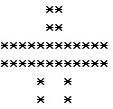

# BC6 小飞机

输出描述：



#### 题解

1. for循环输出String数组

   ```java
   public class Main {
       public static void main(String[] args) {
           String[]  s = {"     **     ", "************", "    *  *    "};
           for (int i = 0; i < 3; i++) {
               System.out.println(s[i] + '\n' + s[i]);
           }
       }
   }
   ```

2. 直接打印

   ```java
   public class Main {
       public static void main(String[] args) {
           System.out.println("     **     ");
           System.out.println("     **     ");
           System.out.println("************");
           System.out.println("************");
           System.out.println("    *  *    ");
           System.out.println("    *  *    ");
       }
   }
   ```